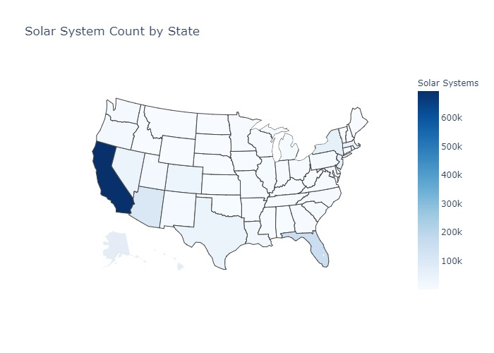
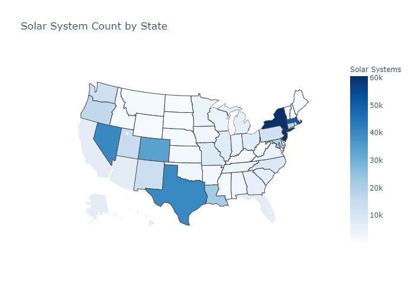
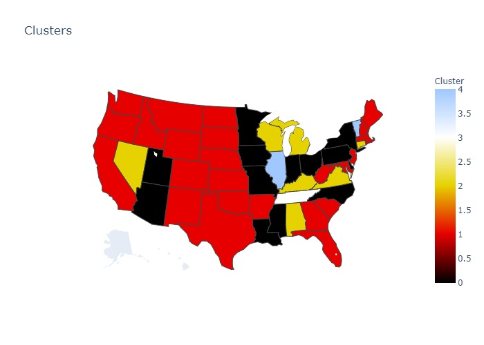

# Data Analysis - Deep Solar Dataset

## Informácie

Dáta pochádzajú [DeepSolar](http://web.stanford.edu/group/deepsolar/home)
projektu. DeepSolar je deep learning framework ktorý analyzuje satelitné dáta
na identifikáciu GPS lokácií a veľkostí solárnych fotovoltalických (PV) panelov.

## Atribúty (výber)

Datová sada obsahuje 169 atribútov. Niektoré atribúty sú:

- **tile_count** - počet obrazových snímkov (dlaždíc) v oblasti riadka
- **tile_count_residential** - počet obrazových snímkov v rezidenčnej oblasti
- **tile_count_nonresidential** - počet obrázskových snímkov v nebytovej oblasti
- **Počet solárnych panelov** - počet solárnych panelov vo všetkych dlaždiciach
- **average_household_income** - priemerný príjem na domácnosť
- **county** - okres/kraj
- **state** - štát
- **population** - počet obyvateľov
- **education_\*** - atribúty spojené so stupňom dosiahnutého vzdelania
- **heating_fuel_\*** - atribúty spojené s typom paliva použitého na vykurovanie
- **age_\*** - atribúty spojené s počtom obyvateľov v danej vekovej kategórii
- **lat, lon, elevation** - GPS koordináty
- **frost_days** - denná akumulácia stupňov kedy je priemerná denná teplota
  nižšia než 0 stupňov Celzia
- **daily_solar_radiation** - priemerná radiácia slnka (Kwh/meter štvorcový) za 
  deň
- **heating_degree_days** - počet dní, kedy je priemerná teplota menšia než 18
  stupňov, indikuje, či je nutné vykurovať
- **cooling_degree_days** - počet dní, kedy je priemerná teplota vačšia ako 18
  stupňov
- **wind_speed** - priemerná rýchlosť vetra
- **electricity_price_\*** - atribúty spojené s cenou elektriny (priemer za 5 rokov)

## Solar System Count

Môžeme vidieť, že najvačší počet solárnych panelov, s veľkým odskokom má
Kalifornia, za ňou následuje Florida. Po odstránení prvých troch najpočetnejších štátov (vzhľadom na počet solárnych panelov), môžeme vidieť, že vačšina solárnych panelov sa vyskytuje na západnom a východnom pobreží, zaťialčo vo vnútrozemí sa nevyskytuje veľký počet panelov.

Z histogramu môžeme vidieť, že vačšina štátov má len do 50 000 solárnych panelov, výnimkami sú hlavne Kalifornia, Florida a Arizona.

## Zhlukovanie

Na zhlukovanie som použil algoritmus Birch, s prednastaveným počtom zhlukov na 5 a vybral som atribúty, ktoré boli spojené s cenou/spotrebou elektriny a so vzdelaním obyvateľov.

### Cluster Education

|   Cluster |   Less Highschool |   High School |   College |   Bachelor |   Master |   Professional |   Doctoral |   Solar Count |
|-----------|-------------------|---------------|-----------|------------|----------|----------------|------------|---------------|
|         1 |             0.159 |         0.257 |     0.292 |      0.184 |    0.075 |          0.02  |      0.014 |        37.642 |
|         0 |             0.134 |         0.312 |     0.283 |      0.167 |    0.075 |          0.018 |      0.012 |        11.235 |
|         2 |             0.132 |         0.303 |     0.304 |      0.16  |    0.073 |          0.017 |      0.011 |         5.78  |
|         3 |             0.159 |         0.342 |     0.269 |      0.146 |    0.058 |          0.015 |      0.011 |         2.435 |
|         4 |             0.129 |         0.281 |     0.286 |      0.186 |    0.085 |          0.02  |      0.012 |         2.362 |

Pri tabuľke vzdelanosti môžme vidieť, že vzdelanosť obyvateľstva veľký vplyv
na počet solárnych panelov nemá, s výnimkou zhluku 1, kde máme vyšší počet panelov ako aj ľudí s vyšším dosiahnutým vzdelaním.

### Avg Electricity Retail Rate

|   Cluster |   Priemerná cena elektriny: max |   Priemerná cena elektriny: mean |   Priemerná cena elektriny: min |
|-----------|------------------------------------|-------------------------------------|------------------------------------|
|         0 |                              15.32 |                              10.833 |                               7.63 |
|         1 |                              15.41 |                              11.616 |                               7.25 |
|         2 |                              11    |                               9.846 |                               7.93 |
|         3 |                               9.27 |                               9.27  |                               9.27 |
|         4 |                              14.45 |                               9.279 |                               8.97 |

Z pohľadu na priemernú spotrebu elektriny, môžeme vidieť, to že zhluky s vysokou cenou elektriny (0, 1) majú aj vysoký počet panelov (11, 35).

### Electricity Consume Total

|   Cluster |   Spotreba elektriny: max |   Spotreba elektriny: mean |   Spotreba elektriny: min |
|-----------|----------------------------------|-----------------------------------|----------------------------------|
|         0 |                 243664           |                  197023           |                 127171           |
|         1 |                  96810           |                   59137.6         |                  20802           |
|         2 |                 429839           |                  393491           |                 324093           |
|         3 |                      1.54573e+06 |                       1.54573e+06 |                      1.54573e+06 |
|         4 |                 607008           |                  601901           |                 516526           |

Z pohľadu spotreby energie, sú práve štáty s vysokou cenou elektriny na najnižších miestach, miesto s najnižšou priemernou cenou elektriny má najvačšiu spotrebu.

### Number Of Solar System Per Household

|   Cluster |   Solárne panely v domácnosti: max |   Solárne panely v domácnosti: mean |   Solárne panely v domácnosti: min |
|-----------|---------------------------------------------|----------------------------------------------|---------------------------------------------|
|         0 |                                       0.513 |                                        0.006 |                                           0 |
|         1 |                                       0.56  |                                        0.02  |                                           0 |
|         2 |                                       0.287 |                                        0.003 |                                           0 |
|         3 |                                       0.049 |                                        0.001 |                                           0 |
|         4 |                                       0.053 |                                        0.001 |                                           0 |

Najvyšší priemer solárnych panelov na domácnosť má zhluk 1. V zhlukoch 0, 1
maximum dosahuje až takých úrovní, že v istých krajoch má každá druhá domácnosť solárny panel.

### Solar System Count

|   Cluster |   Počet solárnych panelov: max |   Počet solárnych panelov: mean |   Počet solárnych panelov: min |
|-----------|---------------------------|----------------------------|---------------------------|
|         0 |                      1079 |                     11.235 |                         0 |
|         1 |                      1535 |                     37.642 |                         0 |
|         2 |                       512 |                      5.78  |                         0 |
|         3 |                       106 |                      2.435 |                         0 |
|         4 |                       115 |                      2.362 |                         0 |